<p align="center">
  
</p>

<p align="center">
  <b>Write one Big Plan. A coordinator agent runs the team.</b><br>
  One Rust CLI on top of git worktrees and tmux. No server, no database, no desktop app.<br>
  Your team's roles are plain Markdown and TOML in a plugin, and there can be as many as you like.
</p>

<p align="center">
  <a href="#see-it-run">See it run</a> ·
  <a href="#how-it-differs">How it differs</a> ·
  <a href="#small-core-everything-else-is-a-plugin">Small core</a> ·
  <a href="#make-the-team-yours">Make the team yours</a> ·
  <a href="#get-started-in-five-commands">Get started</a>
</p>

---

`oat-agents` (Open Agent Team) runs a supervised team of coding agents on one machine. You hand
a **Big Plan** to `oat-meta`, the coordinator. It decides the steps and launches each one as a
**Dispatch** of a role (planner, worker, reviewer, or any role your plugin defines), each in its
own git worktree and tmux session. Results come back through a file-based **Run inbox**, and
you watch the whole **Run** live and step in only when you're asked to.

## See it run

<p align="center">
  
</p>

That is `oat-agents tui`, the live view. The Run above is illustrative, but the screen layout,
glyphs and keys are the real ones. Things to look for:

- **An agent splits the work, not you.** `oat-meta` fires the planner, then two workers in
  parallel (one on Claude Code, one on Codex), then an independent reviewer inside the worker's
  own worktree.
- **Failure is kept on record.** The review fails (`✗`), and the correction goes to a *new*
  Dispatch. The failed attempt and its report stay in the roster and in the workflow log.
- **You're asked only when it matters.** 🙋 marks the one decision the coordinator can't make
  from the Big Plan. Press `enter` and type the answer straight into its session.
- **Nothing is hidden.** Every agent shows its tokens and cost, and where its commands ran:
  `pod:…`, or `HOST (no pod)` in yellow when a role wanted a pod and didn't get one.

## How it differs

<p align="center">
  
</p>

|                      | **Multica**                                          | **Orca**                                   | **herdr**                                  | **oat-agents**                                          |
|----------------------|------------------------------------------------------|--------------------------------------------|--------------------------------------------|---------------------------------------------------------|
| What it is           | A platform for managing agents as teammates           | A desktop environment for agents side by side | A terminal multiplexer built for agents  | A CLI that runs a supervised agent team                 |
| Who splits the work  | You, by assigning issues on a board                   | You, by fanning prompts across worktrees   | You, pane by pane                          | **`oat-meta`, from one Big Plan**                        |
| What you run         | Go server, PostgreSQL, web/desktop/mobile apps, a local daemon | An Electron app                  | One Rust binary                            | **One Rust binary, plus the git and tmux you already have** |
| How work is checked  | You review before merging                             | You compare the attempts and merge the best one | Up to you                             | **A reviewer role re-runs the checks independently; you merge** |
| How your team's practice is expressed | In the platform                       | In the app                                 | In your own scripts                        | **A plugin: a directory of Markdown and TOML**           |

In one sentence: the other three put **you** in the dispatcher's seat and make that seat
comfortable. oat-agents gives the seat to **an agent**. You write the outcome you want, answer
its questions, and review what it hands back.

Pick one of the others if you want to steer every agent yourself, want a GUI or a shared web
board for a whole company, or want a better terminal more than a team. Pick oat-agents if you
want to hand off a whole plan and come back to a reviewed result.

<sub>Descriptions of other projects are taken from their own READMEs as of September 2026. If
something here is wrong, please open an issue.</sub>

## Small core, everything else is a plugin

<p align="center">
  
</p>

The core owns the **mechanism** and none of the **practice** (ADR-0001, ADR-0004):

- **One binary.** `oat-agents` is a single Rust executable. At run time it needs only `git`,
  `tmux`, and the agent CLIs you already use (Claude Code or Codex).
- **No service to operate.** There is no server, database or daemon. A Run is branches, tmux
  sessions and plain files under `~/.local/state/oat-agents/`, including an append-only JSONL
  workflow log you can `tail -f`, `jq` or `grep`.
- **Two core roles, and only two.** `oat-meta` coordinates a Run; `oat-console` is your system
  console across Runs (`ctrl+\` in the live view). Every other role comes from a plugin, and
  plugin roles don't carry the `oat-` prefix.
- **Isolation by default.** Each Dispatch gets its own worktree (branch `oat/<run>/<launch>`)
  and its own tmux session. You can `tmux attach` to any of them at any time.
- **Honest verification.** Roles that ask for it run their build and test commands in a pod
  built from your `.devcontainer/`. The role protocol says a check the environment could not
  run is reported as *unverified*, never as a pass.

## Make the team yours

The example plugin ships `planner`, `worker` and `reviewer` so that oat-agents does something
useful on day one. **They are an example, not a fixed set.** A plugin can define any roles:
a `tester`, a `security-auditor`, a `doc-writer`, a `migrator` that runs four at a time, or a
team with no planner at all. The core doesn't know or care what they're called.

A new role is one directory with two files:

```text
team/
├── oat-plugin.toml
├── core/
│   └── oat-meta-instruction.md          # tell oat-meta when to use your roles
└── roles/
    └── security-auditor/
        ├── role.toml
        └── instructions.md
```

```toml
# team/roles/security-auditor/role.toml
description = "Audits a change for security issues and reports findings with evidence."
start = "existing"          # run inside the worktree of the change under audit
exec_environment = false
max_concurrent = 1

[model.claude]
model = "opus"
```

```markdown
<!-- team/roles/security-auditor/instructions.md -->
# Security auditor

You start in the worktree of the change under audit. Look for injection, authorization gaps
and leaked secrets. Report each finding with the file, the line, and why it is exploitable.
```

Pin it next to the example team (or on its own), trust it once, and it's available in the
next Run:

```sh
oat-agents init --force --embedded --path team my-team
oat-agents plugin list --repo .          # prints the exact trust command for each plugin
```

| Want to change…                                      | Where                                                                |
|------------------------------------------------------|----------------------------------------------------------------------|
| Which roles exist and what they do                    | `roles/<role>/role.toml` + `instructions.md` in your plugin           |
| How `oat-meta` divides the work, when to ask, when to give up | `core/oat-meta-instruction.md` in your plugin                 |
| Reusable know-how a role may load                     | `skills/<skill>/SKILL.md`, listed in the role's `skills = [...]`      |
| Model, reasoning effort, or Claude Code vs Codex, per role | `[model.claude]` / `[model.codex]` in `role.toml`, or override per repository in `.oat/roles.toml` |
| How many of one role run at once                      | `max_concurrent`, overridable per repository                          |
| Share one team across repositories                    | Publish the plugin as a git repo and pin it with `init --git <url> <commit\|latest> <name>` |

Every TOML file rejects unknown fields, so a typo fails at load time instead of being silently
ignored. The full format is in [`docs/plugins.md`](docs/plugins.md).

## Get started in five commands

<p align="center">
  
</p>

**You need:** `git`, `tmux`, a Rust toolchain ([rustup.rs](https://rustup.rs), 1.85+, to
build), and at least one agent CLI installed and logged in:
[Claude Code](https://docs.anthropic.com/en/docs/claude-code) (the default) or Codex.

**1. Install with one command, no clone needed.** The script fetches the source into a
temporary directory, builds it, puts `oat-agents` in `~/.local/bin`, installs the
`oat-agents-cli` skill so your own coding agent can explain and drive oat-agents for you, and
then deletes the temporary directory.

```sh
curl -fsSL https://raw.githubusercontent.com/Noopher-AI/oat-agents/main/install.sh | sh
```

<details>
<summary>Other ways to install</summary>

```sh
# Pass options after `sh -s --`: another install directory, a tag or commit, binary only
curl -fsSL https://raw.githubusercontent.com/Noopher-AI/oat-agents/main/install.sh \
  | sh -s -- --bin-dir /usr/local/bin --ref <tag-or-commit> --skip-skill

# With cargo alone (binary only, into ~/.cargo/bin)
cargo install --locked --git https://github.com/Noopher-AI/oat-agents

# From a checkout
git clone https://github.com/Noopher-AI/oat-agents && cd oat-agents && ./install.sh
```

</details>

**2. Point it at a repository.** With no flags, `init` pins the built-in example team.
`--local` keeps the config under `.git/`, so your `git status` stays clean.

```sh
cd ~/src/your-project
oat-agents init --local
```

**3. Trust the plugin once on this machine.** Its instructions will steer your agents, so
oat-agents won't run a plugin you haven't approved.

```sh
oat-agents plugin trust embedded --name example
```

**4. Fire a Run with your Big Plan.** Describe the outcome, not the steps. Use `--input-file`
for a longer plan, or `--agent codex` to run the coordinator on Codex.

```sh
oat-agents meta fire --name rate-limit-login \
  --prompt "Rate-limit the login endpoint: 5 attempts a minute per account, with tests."
```

**5. Watch it.**

```sh
oat-agents tui
```

In the live view, `↑↓` picks an agent and `←→` switches between its `live`, `diff`,
`timeline` and `log` tabs. `enter` types into the selected session (`ctrl+]` gives the keys
back), and `ctrl+\` opens the console. When the Run is done, `oat-meta` closes it with
`meta finish` and prints a receipt. The work is on the Run's `oat/<run>/…` branches for you to
review and merge.

> **Tip:** Ask your own Claude Code or Codex "how do I use oat-agents?". The `oat-agents-cli`
> skill that `install.sh` installed walks you through starting, observing and taking over a
> Run.

### Optional: run checks in pods

Roles that declare `exec_environment = true` run their build and test commands in a pod built
from the repository's `.devcontainer/`, but only when the Run has an execution profile. Set one
up once per machine:

```sh
oat-agents init --repo . --exec-profile local --exec-context <kube-context> --exec-namespace <namespace>
$EDITOR ~/.oat/exec.toml           # finish the [image] table; every field is there, commented
oat-agents env doctor --profile local
oat-agents env image  --profile local
```

Where commands run is never hidden: `meta fire` and `role fire` report it and warn when a role
that wanted a pod will run on the host, the workflow log records it, and the live view shows
`pod:…` or `HOST (no pod)` beside every Run and agent. See
[`docs/exec-environments.md`](docs/exec-environments.md).

## Words you'll see

| Word | Meaning |
|---|---|
| **Big Plan** | What you want done, written for the coordinator. It states the outcome, not a list of steps. |
| **Run** | One execution of one Big Plan, from `meta fire` to `meta finish`. |
| **Dispatch** | One launch of one role: one session, one worktree, one settlement. A retry is a new Dispatch. |
| **Settle** | How an agent ends its own Dispatch, with an outcome and a report. |
| **Run inbox** | Messages from the Run's agents to `oat-meta`. Only `oat-meta` reads it. |
| **Workflow log** | The append-only record of the Run. It's what you and the live view read. |

The full glossary, including the words we deliberately avoid, is in
[`.dev_docs/CONTEXT.md`](.dev_docs/CONTEXT.md).

## Reading further

- [`docs/plugins.md`](docs/plugins.md): writing a plugin, with the on-disk format and a worked example
- [`docs/exec-environments.md`](docs/exec-environments.md): pods, from setting up a profile to choosing one for a Run and seeing it
- [`.dev_docs/adr/`](.dev_docs/adr/): the architecture decisions
- [`AGENTS.md`](AGENTS.md): how to work in this repository, including the verification commands

## License

MIT.
