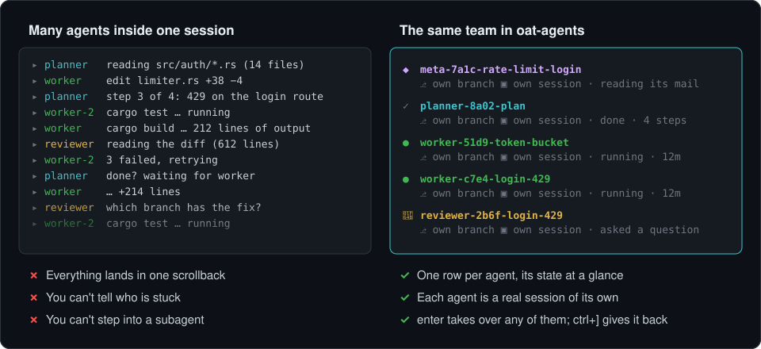

<p align="center">
  <a href="README.md">English</a> · <b>繁體中文</b>
</p>

<p align="center">
  
</p>

<h1 align="center">oat-agents</h1>

<p align="center">
  <b>一個畫面看整個團隊，一個鍵接手任何一個 agent。</b><br>
  一個 meta-agent 把你的目標分給一整隊 coding agent。每個 agent 都是它自己那個 CLI 的真實 session，
  各在自己的 branch 上。你在同一個終端機裡看著所有人，隨時可以進去任何一個。
</p>

<p align="center">
  <a href="#為什麼">為什麼</a> ·
  <a href="#一個-run-怎麼跑">一個 Run 怎麼跑</a> ·
  <a href="#你的團隊你的規則">你的團隊，你的規則</a> ·
  <a href="#什麼在哪裡執行">什麼在哪裡執行</a> ·
  <a href="#五個指令上手">開始使用</a>
</p>

> 本文件是 [README.md](README.md) 的繁體中文版，內容若有出入以英文版為準。meta-agent、member agent、
> Run、Dispatch、Run inbox 等詞保留英文，意思見文末〈[會看到的詞](#會看到的詞)〉。圖片和連結的文件都是英文。

---

## 為什麼

coding agent 早就能自己開 subagent。開一兩個還好；在一個真實的變更上開到五個，就很難跟上了。

<p align="center">
  
</p>

在同一個 session 裡，所有 subagent 的輸出都擠進同一個捲動紀錄。你看不出哪一個卡住了；某一個出錯時，你也沒辦法直接跟它說話，只能請上層的 agent 幫你轉達。

oat-agents 把 subagent 從那個 session 裡拿出來。每個 agent 都跑在自己的 tmux session 裡，有自己的
git worktree 和 branch，用的是那個 agent CLI 原本的互動介面。其中一個叫 meta-agent，負責帶隊：它把你的目標拆成幾塊，每一塊交給一個 member agent。即時檢視把整個團隊放在同一個畫面上，一個 agent 一列。

agent 本身沒有另外一套新介面。選一個 agent 按 `enter`，你就是在它真正的 session 裡打字，跟你自己打開它沒有兩樣。按 `ctrl+]` 回到團隊。

## 一個 Run 怎麼跑

<p align="center">
  
</p>

這是 `oat-agents tui`。畫面中的 Run 是示意，但版面、符號和按鍵都是真的。

1. 你用一個目標（goal）開始 Run：`oat-agents meta fire --prompt "…"`。寫你要的結果就好，步驟不用寫。
2. meta-agent 用 `role fire` 派出 member agent：一個 planner、兩個 worker、一個 reviewer，或是你的 plugin 定義的任何角色。程式碼它自己不寫。
3. member 透過 Run inbox 寫信給 meta-agent。做完的寄報告（`dispatch done`），卡住的提問（`dispatch ask`）並等回覆。inbox 只有 meta-agent 會讀。
4. meta-agent 遇到光看目標決定不了的事，它那一列會出現 🙋。選它、按 `enter`，打字回答就行。其他時候它不會來問你。
5. 審查沒過時，修正會交給一個*新的* member agent。失敗的那次嘗試還留著它那一列、它的報告，以及它在 workflow log 裡的紀錄。
6. meta-agent 用 `meta finish` 結束 Run，並印出收據。成果在這個 Run 的 `oat/<run>/…` branch 上，由你審查、合併。

要站多近由你決定。可以留在高處：看 roster、打開 meta-agent 的 checklist（`ctrl+l`），或直接問 meta-agent 進度如何。也可以下到任何一個 member，看它的 diff，直接跟它一起做。

## 你的團隊，你的規則

<p align="center">
  
</p>

你的團隊怎麼工作，寫在 plugin 裡。plugin 就是一個放 Markdown 和 TOML 的目錄，它決定有哪些角色、每個角色收到什麼指示、跑在哪個模型上，以及 meta-agent 該怎麼拆分工作、何時該問你。核心只提供機制，其他一概不管（ADR-0001、ADR-0004）。

範例 plugin 內建 `planner`、`worker` 和 `reviewer`，讓 oat-agents 第一天就能做點有用的事。你的 plugin 可以留著它們、換掉它們，或加上 `tester`、`security-auditor`、一次跑四個的 `migrator`。完全沒有 planner 的團隊也可以。

新增一個角色，就是一個放了兩個檔案的目錄：

```text
team/
├── oat-plugin.toml
├── core/
│   └── oat-meta-instruction.md          # 告訴 meta-agent 什麼時候該用你的角色
└── roles/
    └── security-auditor/
        ├── role.toml
        └── instructions.md
```

```toml
# team/roles/security-auditor/role.toml
description = "Audits a change for security issues and reports findings with evidence."
start = "existing"          # 在被審查的變更所在的 worktree 裡執行
exec_environment = false
max_concurrent = 1

[model.claude]
model = "opus"
```

```markdown
<!-- team/roles/security-auditor/instructions.md -->
# Security auditor

You start in the worktree of the change under audit. Look for injection, authorization gaps
and leaked secrets. Report each finding with the file, the line, and why it is exploitable.
```

把它釘選在範例團隊旁邊（或單獨使用），信任一次，下一個 Run 就能用：

```sh
oat-agents init --force --embedded --path team my-team
oat-agents plugin list --repo .          # 會為每個 plugin 印出確切的 trust 指令
```

| 想改什麼…                                             | 在哪裡改                                                              |
|------------------------------------------------------|----------------------------------------------------------------------|
| 有哪些角色、各自做什麼                                  | plugin 裡的 `roles/<role>/role.toml` 與 `instructions.md`              |
| meta-agent 怎麼拆分工作、何時該問、何時該放棄            | plugin 裡的 `core/oat-meta-instruction.md`                             |
| 角色可以載入的可重用知識                                 | `skills/<skill>/SKILL.md`，並列在該角色的 `skills = [...]` 中           |
| 每個角色的模型、推理強度或 backend                        | `role.toml` 裡的 `[model.claude]`／`[model.codex]`，或在各 repository 的 `.oat/roles.toml` 覆寫 |
| 同一個角色最多同時跑幾個                                 | `max_concurrent`，可在各 repository 覆寫                                |
| 在多個 repository 之間共用同一個團隊                     | 把 plugin 發佈成 git repo，再用 `init --git <url> <commit\|latest> <name>` 釘選 |

所有 TOML 檔都會拒絕未知欄位，所以打錯字會在載入時就失敗，而不是被默默忽略。完整格式請見
[`docs/plugins.md`](docs/plugins.md)。

## 什麼在哪裡執行

`oat-agents` 是單一的 Rust 執行檔，背後沒有伺服器、資料庫或 daemon。一個 Run 就是一些 branch、tmux session，以及 `~/.local/state/oat-agents/` 底下的純文字檔。workflow log 也在裡面，是一份只會往後附加的 JSONL 檔，可以直接 `tail -f`、`jq` 或 `grep`。

每個 member agent 都有一個在自己 branch（`oat/<run>/<name>`）上的 worktree，以及 oat-agents 私有 tmux server 上的一個 session。`meta fire` 和 `role fire` 會印出 attach 進去的指令（`tmux -L oat attach -t oat_<…>`）。

設了 `exec_environment = true` 的角色，會在用你的 `.devcontainer/` 建出來的 pod 裡（目前支援 Kubernetes）跑建置和測試指令，前提是這個 Run 有 execution profile。agent 本身和其他所有東西都留在你的機器上。即時檢視會在每個 agent 旁邊顯示 `pod:…`；要了 pod 卻沒拿到的角色，會以黃色顯示 `HOST (no pod)`。如果執行環境跑不了某項檢查，角色協定要求 agent 回報為*未驗證*，不能當成通過。

agent 是在沒人看著的情況下執行的。沒有人在旁邊一步步核准，所以 oat-agents 啟動 agent CLI 時會關掉它的權限確認。worktree 只是把每個 agent 的工作分開，並不會限制 agent 能碰到什麼，所以請只在你放心交給 agent 的機器上、用你放心交給它的憑證來跑 oat-agents。

目前支援的 backend 是 Claude Code 和 Codex。每個角色可以各選一個，所以同一個團隊可以混用。

## 五個指令上手

<p align="center">
  
</p>

**你需要：** `git`、`tmux`、Rust 工具鏈（[rustup.rs](https://rustup.rs)，1.85 以上，用來建置），以及至少一個已安裝並登入的 agent CLI：Claude Code（預設）或 Codex。

**1. 一行指令安裝。** 不必先 clone，這支腳本會把原始碼抓到暫存目錄、建置、把 `oat-agents` 放進 `~/.local/bin`、安裝 `oat-agents-cli` skill（讓你自己的 coding agent 能幫你解說並操作 oat-agents），最後刪除暫存目錄。

```sh
curl -fsSL https://raw.githubusercontent.com/Noopher-AI/oat-agents/main/install.sh | sh
```

<details>
<summary>其他安裝方式</summary>

```sh
# 在 `sh -s --` 之後加選項：換個安裝目錄、指定 tag 或 commit、只裝執行檔
curl -fsSL https://raw.githubusercontent.com/Noopher-AI/oat-agents/main/install.sh \
  | sh -s -- --bin-dir /usr/local/bin --ref <tag-or-commit> --skip-skill

# 只用 cargo（只裝執行檔，裝到 ~/.cargo/bin）
cargo install --locked --git https://github.com/Noopher-AI/oat-agents

# 從 clone 下來的原始碼安裝
git clone https://github.com/Noopher-AI/oat-agents && cd oat-agents && ./install.sh
```

</details>

**2. 指向一個 repository。** 不加任何旗標時，`init` 會釘選內建的範例團隊。`--local` 會把設定放在 `.git/` 底下，讓你的 `git status` 保持乾淨。

```sh
cd ~/src/your-project
oat-agents init --local
```

**3. 在這台機器上信任這個 plugin 一次。** 它的指示會引導你的 agent，所以 oat-agents 不會執行你沒核准過的 plugin。

```sh
oat-agents plugin trust embedded --name example
```

**4. 用一個目標開始一個 Run。** 寫你要的結果就好，不用寫步驟。目標比較長時用 `--input-file`，想讓 meta-agent 跑在 Codex 上就加 `--agent codex`。

```sh
oat-agents meta fire --name rate-limit-login \
  --prompt "Rate-limit the login endpoint: 5 attempts a minute per account, with tests."
```

**5. 看著團隊工作。**

```sh
oat-agents tui
```

`↑↓` 選擇 agent，`←→` 在它的 `live`、`diff`、`timeline`、`log` 分頁之間切換。`enter` 直接在選取的 session 裡打字，`ctrl+]` 把按鍵控制交回來，`ctrl+l` 開啟 checklist，`ctrl+\` 開啟主控台。

> **提示：** 問問你自己的 coding agent「how do I use oat-agents?」。`install.sh` 安裝的 `oat-agents-cli` skill 會帶它一步步啟動、觀察並接手一個 Run。

### 選用：在 pod 裡執行檢查

每台機器設定一次 execution profile，有需要的角色就會在 pod 裡執行建置與測試指令：

```sh
oat-agents init --repo . --exec-profile local --exec-context <kube-context> --exec-namespace <namespace>
$EDITOR ~/.oat/exec.toml           # 補完 [image] 區段；每個欄位都已列出並附上註解
oat-agents env doctor --profile local
oat-agents env image  --profile local
```

`meta fire` 和 `role fire` 會回報指令在哪裡執行，並在要求 pod 的角色將在主機上執行時發出警告。詳見 [`docs/exec-environments.md`](docs/exec-environments.md)。

## 會看到的詞

| 詞 | 意思 |
|---|---|
| **Goal（目標）** | 你想完成的事，寫給 meta-agent 看。它描述結果，而不是步驟。 |
| **Run** | 一個目標的一次執行，從 `meta fire` 到 `meta finish`。 |
| **Meta-agent** | 帶領一個 Run 的 agent：拆分目標、派出 member agent、讀它們的信。它跑的是核心角色 `oat-meta`。 |
| **Member agent** | meta-agent 為某一塊工作派出的 agent，扮演你的 plugin 裡的某個角色。 |
| **Dispatch** | 某個角色的一次啟動：一個 session、一個 worktree、一次結算。重試就是一個新的 Dispatch。 |
| **Run inbox** | member agent 寄給 meta-agent 的信：報告和問題。只有 meta-agent 會讀。 |
| **Workflow log** | 這個 Run 只會附加寫入的紀錄。你和即時檢視讀的都是它。 |

完整詞彙表（包括我們刻意避免使用的詞）在 [`.dev_docs/CONTEXT.md`](.dev_docs/CONTEXT.md)，以英文撰寫。

## 延伸閱讀

以下文件皆以英文撰寫。

- [`docs/plugins.md`](docs/plugins.md)：如何撰寫 plugin，包含磁碟上的格式與完整範例
- [`docs/exec-environments.md`](docs/exec-environments.md)：pod，從設定 profile、為 Run 選擇 profile 到查看執行位置
- [`.dev_docs/adr/`](.dev_docs/adr/)：架構決策紀錄
- [`AGENTS.md`](AGENTS.md)：在這個 repository 工作的規則，包含驗證指令

## 參與貢獻

歡迎提出 issue 與 pull request。請從 [`CONTRIBUTING.md`](CONTRIBUTING.md) 開始；安全性漏洞請依 [`SECURITY.md`](SECURITY.md) 的說明私下回報。所有參與者都應遵守[行為準則](CODE_OF_CONDUCT.md)。

## 授權

[MIT](LICENSE)。
